# 《downward》

## 一、游戏概述

- **游戏类型**：2D横板像素风 · 地底探索解谜
- **核心体验**：扮演一名坠入地底深渊的探险者，在漆黑的地下洞穴中依靠有限的光源摸索前行。光既是生存的工具，也是引诱危险的信标——每一次点亮灯火都是一次冒险与抉择。
- **独特体验**：光暗二元博弈。游戏不设战斗系统，开灯获得视野但暴露位置，关灯隐匿身形但寸步难行。三大道具（照明灯、二段跳靴、召唤哨）层层解锁，驱动地图探索与解谜深度螺旋上升。
- **核心玩法循环**：探索房间 → 利用关卡机制解谜 → 解锁新区域 → 获取新道具 → 遭遇更复杂的谜题 → 推进至深层
- **驱动与目标**：寻找通往地表的出路。地底深处潜伏着对光极度敏感的猎食者，玩家需巧妙运用解谜机制与鼠类同伴的配合，穿越层层险阻，最终逃出生天。
- **游戏挑战**：无战斗、无血条。失败惩罚为"被怪物发现并扑杀→返回房间入口重来"。核心挑战在于观察环境、理解解谜规律、规划行动路线，并在限时压力下完成潜行与道具配合操作。

---

## 二、核心系统

### （一）玩家角色

#### 1. 玩家控制

| 按键     | 功能         | 设计细节                                                   |
| -------- | ------------ | ---------------------------------------------------------- |
| A / D    | 左右移动     | 带轻微惯性，起步与停止有短暂加速度，模拟洞穴行走的手感     |
| 空格     | 跳跃         | 基础单段跳跃，获取二段跳靴后可在空中再按一次空格           |
| F        | 切换照明灯   | 按一次开灯，再按一次关灯。                                 |
| 鼠标移动 | 控制灯光方向 | 开灯状态下，灯光锥形方向实时跟随鼠标位置，鼠标决定照射角度 |
| Q        | 吹响召唤哨   | 召唤/收回小老鼠。按R切换老鼠/玩家操控模式                  |
| E        | 互动         | 激活机关、拾取道具等                                       |

**老鼠操控模式**（按R切换后）：

| 按键  | 功能         | 设计细节                                   |
| ----- | ------------ | ------------------------------------------ |
| A / D | 老鼠左右移动 | 速度比玩家快30%，体型小，可穿过1格高窄缝   |
| 空格  | 老鼠跳跃     | 老鼠自带二段跳能力，跳跃高度低于玩家但灵活 |
| R     | 切回玩家操控 | 老鼠停留在当前位置，保持最后状态           |
| E     | 老鼠互动     | 踩踏小型压力板、钻入小管道触发机关         |

切换至老鼠操控时，玩家角色原地静止不动，摄像机跟随老鼠移动。

#### 2. 玩家属性

| 属性     | 初始值           | 获取方式         | 作用                               |
| -------- | ---------------- | ---------------- | ---------------------------------- |
| 移动速度 | 3格/秒           | 固定             | 水平移动速度                       |
| 跳跃高度 | 3格              | 固定             | 垂直起跳可达高度                   |
| 二段跳   | 无               | 获取羽翎靴后解锁 | 空中二次跳跃，高度2格，合计可达5格 |
| 身体判定 | 12×20像素        | 固定             | 碰撞框                             |
| 灯光范围 | 60°锥形，6格射程 | 固定             | 照明覆盖范围                       |
| 灯光开关 | 关闭             | 获取照明灯后解锁 | 可随时切换                         |
| 老鼠操控 | 无               | 获取召唤哨后解锁 | 可召唤并操控小老鼠                 |

---

### （二）道具系统

道具是驱动地图探索与解谜的核心，每件道具永久持有，不存在消耗与升级。三件道具按固定顺序获取，每件道具解锁后立即改变玩家与环境交互的方式。

#### 1. 照明灯

- **获取位置**：第1房间「觉醒洞穴」
- **外观**：手持式油灯，角色举灯行走时灯光随手臂轻微晃动
- **核心机制**：
  - 按**F**键开关。开灯时，以角色为中心发出60°锥形光束，射程6格，方向由鼠标位置决定
  - 关灯时，角色周围仅有2格半径的微弱自发光（角色自身轮廓可见，但环境几乎全黑）
  - 灯光可照亮隐藏路径、壁画线索等
  - 灯光可激活光敏机关（如水晶开关等），照射水晶触发机关
  - 灯光会吸引对光敏感的生物——尤其是地底猎食者（Boss）
- **设计意图**：照明灯是"视野与风险的权衡"载体。玩家需要光照来解谜和寻路，但光照同时会引来危险。这种矛盾贯穿整个游戏。

| 状态 | 玩家视野          | 隐匿性             | 触发光敏机关 | 吸引猎食者 |
| ---- | ----------------- | ------------------ | ------------ | ---------- |
| 开灯 | 锥形6格清晰可见   | 极低，远距离可见   | 可以         | 是         |
| 关灯 | 2格微光，环境全黑 | 极高，近身才可发现 | 不可以       | 否         |

#### 2. 羽翎靴

- **获取位置**：第7房间「断崖秘径」（下方中央平台）
- **外观**：脚踝处羽毛装饰的轻型靴具，跳跃时拖出微弱气流粒子
- **核心机制**：
  - 装备后，玩家在空中可再按一次空格执行二段跳
  - 二段跳高度为2格，加上首段3格，合计垂直可达5格
  - 二段跳可重置空中水平速度，可用于调整落点、跨越宽间隙
  - 二段跳有0.2s的判定窗口（起跳后0.2s内不可二段跳，防止误触）
- **设计意图**：羽翎靴是地图纵向探索的钥匙。获取前，玩家只能到达3格高度的平台；获取后，5格的可达高度解锁大量先前不可触及的区域与通道。

#### 3. 召唤哨

- **获取位置**：第9房间「双钮石殿」（底部提灯石像）
- **外观**：骨质小哨，吹响时发出高频声波
- **核心机制**：
  - 按**Q**吹哨，召唤一只小老鼠出现在玩家身旁
  - 按**R**切换至老鼠操控模式，摄像机跟随老鼠
  - 老鼠具备独立移动、跳跃、二段跳能力
  - 老鼠体型为6×6像素，可穿过玩家无法通过的窄缝（1格高通道）以及木制平台、小型管道
  - 老鼠可踩踏小型压力板、钻入机关管道触发开关，完成玩家身体无法触及的操作
  - 老鼠被猎食者捕获或掉入陷阱后消失，需等待5秒冷却后重新吹哨召唤
  - 玩家操控老鼠时，玩家本体原地静止，可被环境危险影响
- **设计意图**：召唤哨将"分身操控"引入解谜。玩家需要同时管理两个实体的位置与状态——本体负责光照与大门机关，老鼠负责远程触发与诱敌。这是第12房间Boss战的核心机制基础。

| 对比项       | 玩家             | 小老鼠                   |
| ------------ | ---------------- | ------------------------ |
| 体型         | 12×20            | 6×6                      |
| 移动速度     | 3格/秒           | 5.2格/秒                 |
| 跳跃高度     | 3格 + 二段跳2格  | 2格 + 二段跳1.5格        |
| 使用道具     | 照明灯           | 无                       |
| 触发压力板   | 大型压力板       | 大型+小型压力板          |
| 存活         | 永久             | 被捕获/掉落后5秒冷却重生 |
| 被猎食者追击 | 开灯或暴露光照时 | 进入猎食者感知范围时     |

---

### （三）地图系统

#### 1. 地图架构

- **瓦片尺寸**：16×16像素
- **房间尺寸**：单房间不低于1920×1080（120×67格），房间间通过通道连接
- **地图结构**：类银河战士恶魔城式的互联互通地图。房间非线性排列，部分通道需要特定道具才能通过，鼓励回头探索
- **地图分层**：整体分为浅层、中层、深层三个垂直区间

| 层级 | 深度    | 视觉基调                       | 主要机制             |
| ---- | ------- | ------------------------------ | -------------------- |
| 浅层 | 0-3房间 | 微弱自然光渗透，蓝灰色调       | 基础移动与照明教学   |
| 中层 | 4-6房间 | 完全黑暗，荧光点缀，绿紫色调   | 二段跳与老鼠操控解谜 |
| 深层 | 7-9房间 | 压抑暗红，熔岩裂缝提供危险光源 | 光暗潜行与Boss遭遇   |

#### 2. 房间一览

| 房间编号 | 名称     | 获取道具 | 核心玩法                                                                                                                                     | 设计目的                                                                    |
| -------- | -------- | -------- | -------------------------------------------------------------------------------------------------------------------------------------------- | --------------------------------------------------------------------------- |
| 1        | 觉醒洞穴 | 照明灯   | 平台跳跃+按钮开门+获取照明灯+光敏机关预演                                                                                                    | 基础3C操作教学，建立"光=发现"核心认知                                       |
| 2        | 滴落密语 | 无       | 顺序记忆解谜+水滴颜色观察+装置互动                                                                                                           | 深化"观察→记忆→执行"解谜逻辑，引入顺序机关机制                              |
| 3        | 荧光甬道 | 无       | 双按钮解谜+水体穿越+钥匙门"现在/以后"并置+左上方梯子通往狭长通道                                                                             | 深化"光=发现"认知，引入双按钮机关与水体机制；后期回归枢纽，钥匙门通往Boss房 |
| 4        | 幻菌洞窟 | 无       | 致幻延迟视觉+交替平台跳跃+宝箱获取钥匙与解除幻觉果实                                                                                         | 引入"幻觉延迟"机制，获取第3房间钥匙门的钥匙                                 |
| 5        | 机关囚牢 | 无       | 摇杆控制移动平台+被困+水体穿越+跨房间解谜                                                                                                    | 类银地图互联互通核心体验，困住→发现出路→跨房间联动                          |
| 6        | 翡翠秘藏 | 翡翠宝石 | 对称阶梯平台+宝箱开启+翡翠宝石获取                                                                                                           | 奖励房间，获取通关关键道具                                                  |
| 7        | 断崖秘径 | 羽翎靴   | 二段跳获取+平台跳跃+梯子通往第10房间                                                                                                         | 二段跳教学与能力解锁                                                        |
| 8        | 交替危崖 | 无       | 红绿交替平台+地刺+时机跳跃+梯子通往第9房间                                                                                                   | 纯平台跳跃时机考验，无解谜机关                                              |
| 9        | 双钮石殿 | 召唤哨   | 双按钮协作+老鼠延迟操控+二段跳平台+右侧出口通往第11房间                                                                                      | 召唤哨教学，引入双体协作与延迟操控机制                                      |
| 10       | 琥珀圣龛 | 琥珀宝石 | 老鼠双按钮延迟解谜+回头探索+机关锁+出口通往第11房间                                                                                          | 类银"获取能力→回头解谜"核心体验                                             |
| 11       | 滞转古殿 | 紫金宝石 | 机关滞后解谜+石桥延迟升起+双按钮石门+光透草丛隐藏通道+紫金宝石获取+狭长通道回归第3房间                                                       | 机关延迟机制深化，光穿透发现新路径；终局回归闭环                            |
| 12       | 潜行暗渊 | 无       | 三层结构：第一层关灯潜行+第二层Boss追赶+三项操作（照宝石/老鼠按钮/二段跳按钮）+第三层老鼠诱敌+三宝石嵌入+最终冲刺结局（从第3房间钥匙门进入） | 综合考验，本游戏高潮关卡与结局                                              |

---

### （四）Boss系统——地底猎食者

#### 1. Boss概述

地底猎食者是一只对光源极度敏感的大型地底生物，栖息于第12房间「潜行暗渊」。它没有血条，无法被攻击或击败。玩家与它的关系是"规避与利用"而非"战斗"。

- **外观**：盲眼的大型节肢类生物，体表覆盖感光细胞，头部有敏感的触须。体型约为玩家的8倍，移动速度快于玩家
- **感知方式**：不依赖视觉，而是通过全身感光细胞感知光源，通过地面震动感知脚步声
- **核心规则**：光即威胁。任何光源（玩家灯光、环境光）照射到Boss或Boss感知范围内有光源存在时，Boss进入攻击状态

#### 2. Boss AI状态机

```
┌─────────────┐  光源出现   ┌─────────────┐
│             │ ─────────→ │             │
│   巡逻状态   │             │   警戒状态   │
│  (Patrol)   │ ←───────── │  (Alert)    │
│             │  光源消失    │             │
└─────────────┘             └──────┬──────┘
                                   │ 持续光照/光源接近
                                   ↓
┌─────────────┐  目标脱离视野  ┌─────────────┐
│             │ ←─────────── │             │
│   搜索状态   │              │   追击状态   │
│  (Search)   │              │  (Chase)    │
│             │              │             │
└──────┬──────┘              └──────┬──────┘
       │ 搜索超时(10秒)             │ 老鼠进入感知范围
       ↓                           ↓
┌─────────────┐             ┌─────────────┐
│   巡逻状态   │             │  分心状态    │
│  (Patrol)   │             │ (Distracted)│
└─────────────┘             └─────────────┘
```

| 状态            | 触发条件                                     | Boss行为                               | 持续时间                     |
| --------------- | -------------------------------------------- | -------------------------------------- | ---------------------------- |
| 巡逻 Patrol     | 无光源感知                                   | 沿固定路线缓慢移动，触须低垂           | 永久（直至光源出现）         |
| 警戒 Alert      | 感知到光源（距离>8格）                       | 停止巡逻，触须竖起，朝光源方向缓慢靠近 | 直至光源消失或接近至追击距离 |
| 追击 Chase      | 光源持续存在且距离≤8格，或玩家暴露在环境光下 | 高速冲向光源/玩家位置，触须完全展开    | 直至目标脱离感知范围         |
| 搜索 Search     | 追击目标突然消失（关灯/脱离视野）            | 在最后已知位置附近搜索，触须摆动       | 10秒后恢复巡逻               |
| 分心 Distracted | 追击/警戒状态下，老鼠进入感知范围（≤6格）    | 放弃当前目标，转向追击老鼠             | 直至捕获老鼠或老鼠脱离范围   |

#### 3. Boss攻击逻辑详解

**对玩家**：

| 玩家状态                       | Boss反应             | 结果                                     |
| ------------------------------ | -------------------- | ---------------------------------------- |
| 开灯且在Boss感知范围内（≤8格） | 立即进入追击         | Boss高速冲向玩家，接触即扑杀（失败重来） |
| 关灯但在环境光照射区域内       | 感知到光源，进入追击 | 同上，Boss追击玩家所在的光照位置         |
| 关灯且在完全黑暗中             | 无法感知             | Boss保持巡逻或搜索状态，不攻击           |
| 开灯但超出感知范围（>8格）     | 进入警戒但不追击     | Boss朝光源方向缓慢移动，可能接近         |

**对小老鼠**：

| 老鼠状态                     | Boss反应                           | 结果                                    |
| ---------------------------- | ---------------------------------- | --------------------------------------- |
| 老鼠在Boss感知范围内（≤6格） | 无论老鼠是否发光，Boss优先追击老鼠 | Boss转向追击老鼠，放弃追击玩家          |
| 老鼠被Boss接触               | Boss扑杀老鼠                       | 老鼠消失，进入5秒冷却，Boss进入搜索状态 |
| 老鼠脱离感知范围（>6格）     | Boss放弃追击老鼠                   | 回到搜索状态，10秒后恢复巡逻            |

**优先级规则**：当玩家和老鼠同时处于Boss感知范围内时，Boss优先追击老鼠。这是第12房间Boss战解谜的核心利用点。

#### 4. Boss感知半径示意

```
            ┌─────────────────────────┐
            │      警戒范围 (8格)       │
            │   ┌─────────────────┐   │
            │   │  追击范围 (6格)  │   │
            │   │                 │   │
            │   │    [BOSS]       │   │
            │   │                 │   │
            │   └─────────────────┘   │
            │                         │
            └─────────────────────────┘

老鼠进入6格内 → Boss转向追老鼠
玩家开灯或暴露光照 → 8格内Boss追击玩家
```

---

### （六）解谜系统

#### 1. 谜题设计原则

- **无文字引导**：所有谜题通过环境视觉语言传达规则。玩家通过观察机关外观、光线行为来推断解法
- **单一清晰规则**：每个谜题房间只引入1条新规则或1种新机关组合，避免信息过载
- **失败可即时重试**：谜题失败（坠崖、被抓）后从房间入口重来，无加载等待

#### 2. 谜题类型

| 谜题类型     | 涉及道具      | 机制描述                                                                | 出现房间 |
| ------------ | ------------- | ----------------------------------------------------------------------- | -------- |
| 致幻延迟跳跃 | 无            | 食用蘑菇后画面延迟1秒，需在"看到的是过去"滞后条件下判断交替平台真实位置 |          |
| 照射宝石开门 | 照明灯        | 灯光激活水晶开关打开石门                                                |          |
| 高台跳跃     | 羽翎靴        | 5格高差平台，需二段跳到达，部分平台间距超出单跳距离                     |          |
| 老鼠远程触发 | 召唤哨        | 玩家无法到达的机关需老鼠钻入管道触发                                    |          |
| 双体协作     | 召唤哨+照明灯 | 玩家持灯照亮路径，同时操控老鼠触发远处开关，两者配合开门                |          |
| 交替平台跳跃 | 无            | 红绿平台交替出现，需把握时机跳跃，坠落地刺即失败                        |          |
| 光暗潜行     | 全部三道具    | 第一层关灯潜行+第二层Boss追赶+光敏屏障限时操作+第三层老鼠诱敌+宝石嵌入  |          |

#### 3. 谜题难度曲线

| 房间 | 谜题复杂度                                    | 操作压力                         | 时间限制                               | 容错率                                 |
| ---- | --------------------------------------------- | -------------------------------- | -------------------------------------- | -------------------------------------- |
| 2    | 低——顺序记忆+颜色观察                         | 低（跳跃至观察平台）             | 无                                     | 极高                                   |
| 3    | 中——双按钮顺序+水体穿越                       | 中（跳跃+时机判断）              | 无                                     | 中高                                   |
| 4    | 中高——延迟视觉理解+平台时机判断               | 中高（延迟视觉下精准跳跃）       | 有（平台交替周期）                     | 中低（失败保留致幻状态快速重试）       |
| 5    | 中——摇杆操控+跨房间联动                       | 中（平台跳跃+时机判断）          | 轻微（平台停留时间）                   | 中高（被困后可反复尝试水体）           |
| 6    | 低——平台跳跃到达宝箱                          | 低（阶梯平台下降）               | 无                                     | 高（落入水中不死亡，可重新攀爬）       |
| 7    | 低——二段跳获取+平台跳跃                       | 低（渐进式平台跳跃）             | 无                                     | 高                                     |
| 8    | 中——平台交替时机判断                          | 中高（精准跳跃+时机把握）        | 有（平台交替周期）                     | 中低（坠落地刺即失败，从入口快速重试） |
| 9    | 中高——双体协作+延迟操控                       | 中（时机预判+双体管理）          | 有（老鼠0.8s延迟+门延迟关闭2s）        | 中（按钮松开门延迟关闭，有缓冲时间）   |
| 10   | 中高——纯老鼠延迟操控+双按钮同时触发           | 中高（延迟时机精算+路径规划）    | 有（0.8s延迟窗口）                     | 中低（时机错误需重新操作）             |
| 11   | 中高——机关滞后预判+光透草丛发现               | 中（跳跃平台+等待时机）          | 有（机关延迟窗口）                     | 中（掉入水中不死亡，可重新尝试）       |
| 12   | 极高——三层结构+Boss追赶+限时操作+宝石嵌入抉择 | 高（追赶跑酷+限时操作+最终冲刺） | 有（光敏屏障60秒+老鼠引开15-20秒窗口） | 低（失败从第二层检查点重生，Boss重置） |

---

## 三、关卡设计

### （一）第1房间「觉醒洞穴」详细设计

房间尺寸：1920×1080（120×67格）。整体呈从左到右的横向动线，分为起点区、中段跳跃区、按钮平台区、砖墙密室区和出口区。

##### 房间结构

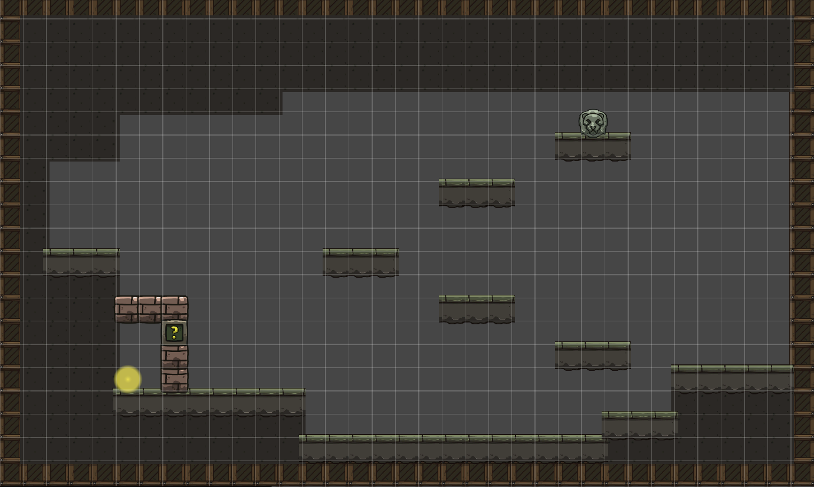

##### 起点区（左端，0-20格）

- **环境**：玩家初始位置。周围为完全黑暗，仅有角色自身1格半径的微光
- **起始平台**：左侧靠墙的一小块天然石台，玩家站定后可自由观察右侧环境

##### 中段平台区（20-60格）

- **环境**：中段地面为凹陷的沟壑，玩家必须经由右侧的阶梯平台向上攀爬
- **阶梯平台**：右侧有一组从左下到右上的阶梯式悬浮平台，玩家需依次跳跃向上，形成明确的"向上→向右"动线引导

##### 按钮平台区（右上端，60-80格）

- **狮子头按钮**：放置于最顶层平台上，玩家到达后即可按下
- **按钮反馈**：按下时狮子头双眼亮起红光，同时发出机械咔哒声，房间左侧的砖墙问号门同步播放砖块移开动画，让玩家明确建立"按钮→门开"的因果关系
- **按钮位置设计**：按钮位于高点，玩家必须完成整个阶梯跳跃才能到达，确保玩家在接触核心机制前已熟悉基本3C操作

##### 砖墙密室区（中下，30-50格）

- **密室结构**：由砖墙围合的小型封闭房间，入口为问号门（按钮控制）
- **照明灯道具**：放置于密室内部平台上，外观为手持式油灯，发出黄色暖光。玩家进入后即可拾取
- **拾取反馈**：获得照明灯时播放简短道具获取动画（油灯从平台浮起、光芒闪烁后收入玩家手中），同时画面边缘出现短暂的操作提示（F键开关灯）

##### 出口区（右端，80-120格）

- **小型光敏水晶**：出口大门前嵌入墙壁的一颗透明水晶，不开灯时仅微弱闪烁
- **出口机关**：玩家开灯照射水晶2秒后，出口大门缓缓开启，发出石磨摩擦的低沉音效
- **视觉引导**：出口方向的水晶闪烁频率略高于其他环境元素，在无灯状态下也能隐约吸引玩家注意

### （二）第2房间「滴落密语」详细设计

房间尺寸：1920×1080（120×67格）。玩家从第1房间右侧出口进入本房间。整体呈横向结构，分为左侧装置区、中央水面观察区、右侧按钮区和石门出口区。本关核心机制是"顺序记忆+观察+执行"——玩家需要按照墙壁符文的顺序互动左侧三个装置，观察天花板水滴滴入水面后产生的颜色，然后按照颜色出现的顺序按下右侧三个颜色按钮，石门才会开启。

##### 房间结构

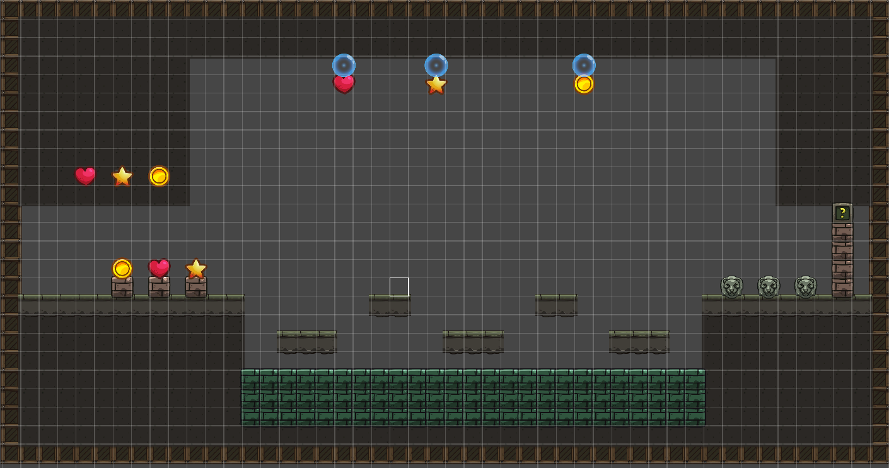

##### 左侧装置区（左端，0-30格）

- **三个互动装置**：从左到右依次为心形装置、星形装置、圆形装置，放置在低矮的基座上。玩家靠近后按E键互动
- **墙壁符文**：左侧墙壁上按水平顺序排列着三个几何符文，与三个装置有一一对应关系。
- **装置互动反馈**：互动装置时，对应的天花板水滴出口发出与装置相同颜色的脉冲光芒（心形=红色、星形=黄色、圆形=蓝色），明确建立"我按了这个→上面的那个会滴水"的因果关系

##### 水滴系统（天花板至水面）

- **三个水滴出口**：天花板上对应三个装置的位置各有一个水滴出口。互动装置后，水滴开始形成、变大、最终坠落
- **下落速度**：水滴从天花板到水面约2-3秒，足够玩家从装置区跑到对应观察平台，但也不会慢到让人不耐烦
- **依次触发机制**：三个装置可以依次触发，不需要等前一个水滴落完再按下一个。每个装置有1秒内置冷却，防止玩家快速连按导致混乱
- **落入水面的视觉效果**：水滴落入水面时产生涟漪+颜色扩散（红/黄/蓝），颜色持续显示约3秒后才逐渐消散。这给玩家足够的时间记住顺序
- **水滴颜色与装置对应**：心形装置→红色水滴、星形装置→黄色水滴、圆形装置→蓝色水滴

##### 中央水面观察区（中段，30-80格）

- **三个观察平台**：悬浮于水面上方的三个小型平台，位置分散。玩家需要移动才能从每个平台上看到对应水滴落入水面的颜色
  - 平台1（偏左）：观察左侧水滴（心形装置对应的水滴）
  - 平台2（居中）：观察中间水滴（星形装置对应的水滴）
  - 平台3（偏右）：观察右侧水滴（圆形装置对应的水滴）
- **平台间距**：控制在普通跳跃范围内（3格以内），这个房间的核心挑战是记忆顺序而非平台跳跃技巧
- **水面设计**：下方为深绿色水面，水滴落入后颜色在水面扩散形成短暂的色块。

##### 右侧按钮区（右端，80-100格）

- **三个颜色按钮**：三个狮子头样式的按钮并排排列，底座颜色分别为红、黄、蓝。与水滴颜色一一对应
- **按钮外观一致性**：三个按钮的狮子头部分外观完全相同，仅底座颜色不同，玩家需要根据水滴颜色而非按钮外观来判断顺序
- **正确按下反馈**：按下正确顺序的按钮时，按钮底座亮起对应颜色，同时发出清脆的"叮"声
- **错误按下反馈**：如果顺序错误，所有按钮闪烁红色1秒，发出低沉的"嗡"声，石门不开。玩家需要重新触发装置观察水滴
- **顺序执行方式**：玩家按顺序走到对应按钮前依次按下，不需要连续快速按下，给予思考时间

##### 石门出口区（最右端，100-120格）

- **右侧石门**：三个按钮全部正确按下后，石门播放开启动画（砖块移开+灰尘粒子+机械声），同时门内透出微弱光线
- **门后过渡**：石门后是一段短通道通往第3房间「荧光甬道」

##### 完整解谜流程示例

1. 玩家观察墙壁符文，理解顺序是"心→星→圆"
2. 按E互动心形装置→天花板左侧水滴出口发光→红色水滴坠落→玩家跳到平台1观察→水面出现红色
3. 按E互动星形装置→天花板中间水滴出口发光→黄色水滴坠落→玩家跳到平台2观察→水面出现黄色
4. 按E互动圆形装置→天花板右侧水滴出口发光→蓝色水滴坠落→玩家跳到平台3观察→水面出现蓝色
5. 玩家记忆顺序：红→黄→蓝
6. 走到右侧，依次按下红按钮→黄按钮→蓝按钮
7. 石门开启，进入第3房间

> 若玩家顺序错误（如按成了红→蓝→黄），按钮闪烁红色+嗡声，石门不开，玩家需重新触发装置观察。

### （三）第3房间「荧光甬道」详细设计

房间尺寸：1920×1080（120×67格）。紧接第2房间右侧，整体呈纵向多层结构，分为入口区、中央平台区、按钮解谜区、水体坠落区、钥匙门预留区和左上方狭长通道入口。本关核心目标是引入双按钮机关、水体穿越和"现在/以后"并置的类银探索逻辑。房间左上角另有一处梯子通往向上的狭长通道，连接第11房间，但首次到达时因跳跃高度不足无法攀上。

##### 房间结构

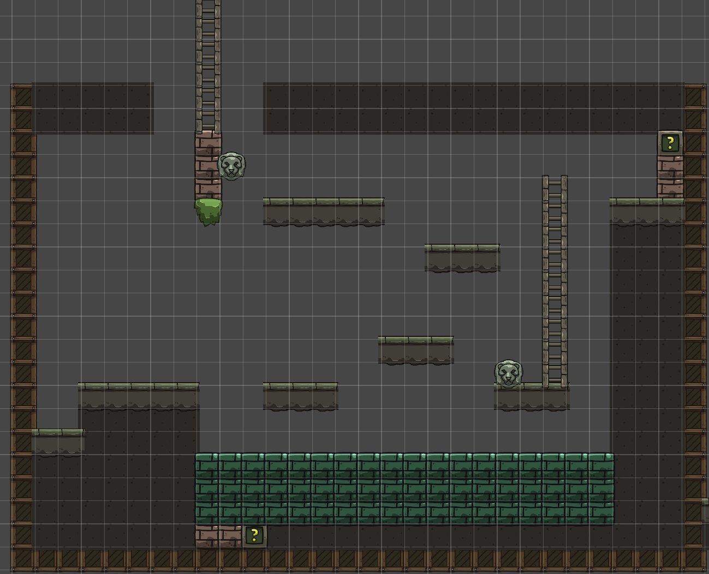

##### 入口区（左上端，0-20格）

- **环境**：玩家从第2房间右侧石门出口进入，初始位置位于房间左下方的天然石台上。
- **右上视野**：玩家站定后，视线自然向右上方扫去，可以瞥见右上角的问号门和门旁格外明亮的荧光水晶——这是玩家第一次看到"明显有东西但过不去"的场景，埋下"以后回来"的种子
- **门旁刻痕**：右上角问号门旁边的墙壁上有模糊刻痕，关灯时几乎不可见。开灯后刻痕显现出钥匙孔图标——第一次向玩家传达"需要特定道具才能打开"的类银探索逻辑
- **第一次紧张感**：房间深处（右下按钮附近）有一只休眠的小型光敏生物，玩家开灯照射后会发出警告般的尖啸声（伴随画面轻微震动），但不主动攻击。这是玩家第一次体验到"开灯带来了反应"，为后续Boss战的恐惧感做铺垫

##### 左上方狭长通道入口（左上角高处）

- **梯子位置**：房间左上角高处有一架向上的梯子，梯子起始点位于一个较高的平台上，平台距离地面约5-6格
- **首次无法到达**：玩家第一次进入第3房间时尚未获得羽翎靴（二段跳），单段跳跃高度不足以到达梯子起始平台。玩家可以看到梯子的下端在黑暗中若隐若现，但无法攀上——这是又一处"现在/以后"并置设计
- **二段跳后可达**：玩家在第7房间获得羽翎靴后，可利用二段跳到达梯子起始平台，攀爬梯子向上进入狭长通道
- **狭长通道**：梯子向上延伸约15-20格，通道狭窄（仅2格宽），两侧为石壁。通道向上通往第11房间「滞转古殿」的右侧出口
- **设计意图**：这处梯子是第11房间与第3房间之间的回环连接。玩家在游戏后期从第11房间右侧出口离开后，通过狭长通道向下攀爬，会回到熟悉的第3房间——形成"从深处回归"的探索闭环

##### 中央平台区与梯子（20-80格）

- **梯子**：房间中央有一架贯通上下的长梯子，是连接各层的主要通道。梯子中段向左侧突出一个短平台，玩家可从此处跳到左侧的中央悬浮平台上
- **梯子作为观察点**：玩家爬到梯子高处时，视野越过中层平台，可以清晰地看到左上按钮平台的轮廓——自然引导玩家"高处有东西"
- **右下按钮的微光提示**：右下按钮所在的平台区域有几乎不可察觉的微弱荧光，暗示"这里有东西"但不足以让玩家定位，引导玩家主动开灯查看

##### 按钮解谜区（左上+右下）

- **双按钮机制**：房间设有两个狮子头按钮——右下按钮（地面层）和左上按钮（高台悬挂）
- **左上按钮的隐身设计**：左上按钮所在的砖墙平台在关灯状态下完全融入黑暗，玩家第一次进入房间时看不到它。
- **如果玩家先碰左上按钮**：按钮被一层暗影屏障包裹，玩家触碰时有被弹开的手感反馈（伴随低沉的嗡鸣声），暗示"需要先激活什么才能解锁"
- **按下右下按钮的反馈**：右下按钮按下时，狮子头双眼亮起红光，发出机械咔哒声，同时左上按钮的砖墙发出一次短暂的金色脉冲光芒（持续0.5秒），明确告诉玩家"那边有变化了，去看看"
- **正确的解谜顺序**：玩家按下右下按钮→观察到左上按钮发光→攀爬梯子/跳跃至左上按钮平台→触碰左上按钮

##### 水体坠落区（底部，50-67格）

- **左上按钮下方的水体**：左上按钮平台正下方悬挂着一块绿色水体（玩家触碰按钮后自然坠落的路径上）
- **水体边界的视觉设计**：底部水体区域在关灯时水面边界模糊，玩家可能误以为是深渊不敢跳。开灯后水面发出微弱的绿色荧光，边界清晰可见
- **坠落前的安全确认**：玩家从左上按钮平台坠落时，空中有足够的视野时间能看到下方的绿色水面，不会直直落入完全看不见的黑暗中
- **水体穿越的视觉表现**：玩家穿过水面时播放短暂的"浸入"动画（角色半透明+气泡粒子），出水后恢复正常。这明确传达"水体是可以穿过的安全区域"
- **水体下方的问号门**：双按钮都按下后，水体下方的问号门打开，同时整个水体区域发出一次绿色光芒脉冲，让玩家明确建立"双按钮→门开→可以进入下方"的因果链
- **水流方向暗示**：底部水体有非常缓慢向左流动的视觉效果，暗示"下方出口在左侧"，与左下角问号门的位置呼应

##### "现在/以后"并置设计

- **右上角钥匙门**：需要第4房间获取的钥匙才能开启。门后是一段通往第12房间「潜行暗渊」（Boss房）的通道——这是玩家最终通往Boss房的入口
- **门的存在感管理**：问号门位于玩家进入房间后的自然视野范围内，门旁的荧光水晶闪烁频率高于其他环境元素，吸引注意力但不喧宾夺主
- **与下方出口的对比**：一个现在就能进（水体下方），一个以后才能进（右上角钥匙门）——这是类银地图非常经典的"现在/以后"并置设计，让玩家对回头探索产生期待
- **刻痕叙事**：门旁墙壁的刻痕在开灯后不仅显示钥匙孔图标，还显现出少量壁画纹理，暗示门后通向某种危险的深处
- **后期回归**：玩家集齐三颗宝石后，从第11房间右侧出口经狭长通道回到第3房间，用钥匙打开此门，正式进入Boss房。这使得第3房间成为游戏后期回归的关键枢纽——玩家首次经过时埋下的伏笔在终局得到回收

##### 通往下方房间的过渡

- 玩家穿过水体、落入下方问号门后，进入一个短小的垂直下落通道（约3-4格高度），落地后即为第4房间的入口区域
- 下落过程中两侧墙壁有微弱的荧光苔藓点缀，形成自然的光引导，避免玩家在过渡时产生"掉到哪里去了"的困惑

### （四）第4房间「幻菌洞窟」详细设计

房间尺寸：1920×1080（120×67格）。玩家从第3房间水体坠落通道落入本房间。整体呈纵向结构，分为坠落着陆区、教学缓冲区、交替平台挑战区、宝箱奖励区和底部按钮预留区。本关核心机制是"致幻延迟视觉"——玩家食用致幻蘑菇后看到的一切画面均为1秒前的状态，必须在"看到的是过去"的条件下完成平台跳跃挑战。

##### 房间结构

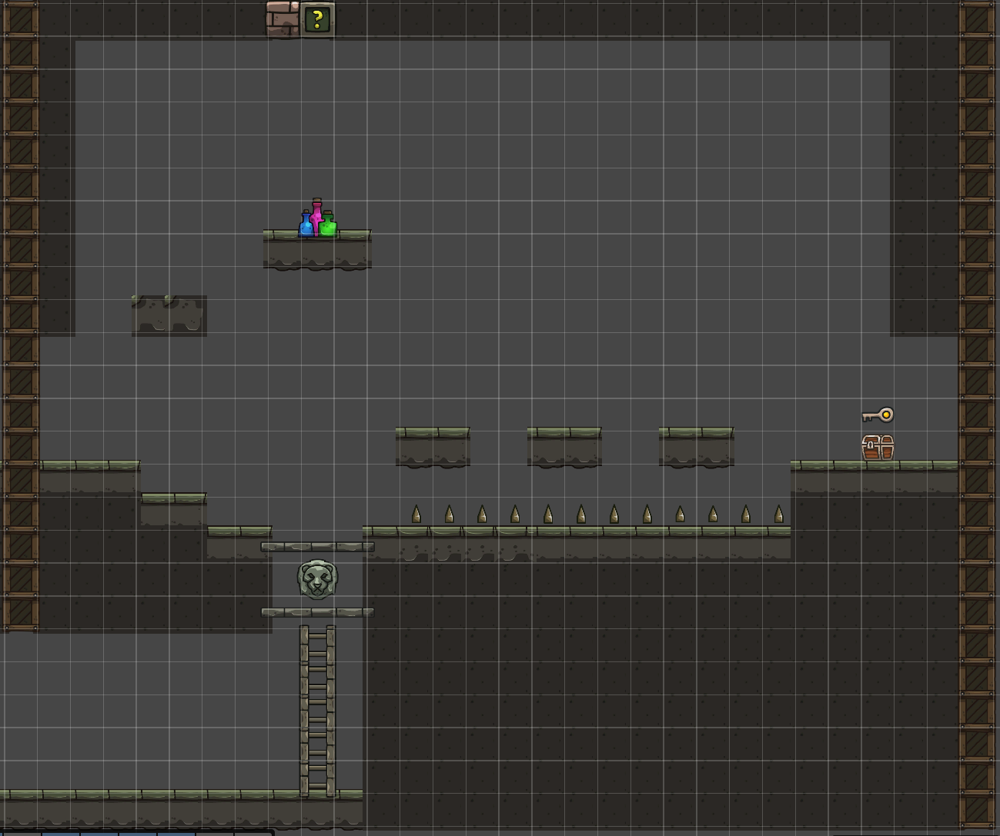

##### 坠落着陆区（左上端，0-20格）

- **坠落入口**：玩家从第3房间水体下方的短通道坠入，落在左上角的一块棕红色砖块平台上
- **致幻蘑菇**：平台旁边放置一簇发出诡异紫绿色微光的蘑菇（与环境中正常的绿色荧光蘑菇形成色彩对比，暗示"有些光是危险的，不是所有发光的东西都是好的"）。玩家靠近后按E食用
- **食用反馈**：食用后画面先短暂扭曲变色（约2秒），色彩饱和度异常、边缘出现色差，随后画面"恢复正常"——但实际上此时已进入1秒延迟视觉状态，玩家尚未察觉

##### 教学缓冲区（中上层，20-40格）

玩家食用蘑菇后并不直接面对危险，而是先经过一段无危险的区域，让玩家理解"延迟视觉"的概念。

- **虚空平台**：一个静止不动的平台供玩家试跳。玩家跳向平台会直接坠落而不会落在平台上，让玩家意识到自己的视觉出现了问题
- **灯光异常暗示**：如果玩家在此区域开灯，会发现锥形光束的方向也产生1秒延迟——玩家转向左边，灯光还在指向右边，1秒后才跟过来。这强化了"幻觉影响所有视觉感知"的认知。
- **设计意图**：让玩家在无惩罚的环境中自主发现延迟视觉的存在，而不是在地刺上用死亡来学习

##### 交替平台挑战区（中下层，40-80格）

理解延迟视觉后，玩家面对真正的挑战。

- **三个交替平台**：右下方有3个等距悬浮平台，交替周期为1秒。这增加了玩家对于跳跃时机的判断难度
- **地刺区域**：平台下方为一排地刺。
- **失败反馈**：玩家掉入地刺时，设计成"玩家看到自己跳向了'看起来存在'的平台，但穿过去坠落"的瞬间——这个"穿模"的视觉冲击力正是延迟视觉机制最恐怖/最有趣的体现，应让玩家充分感受到
- **重生机制**：失败后在左下角重生点复活。重生后玩家保留致幻状态（不清除），无需重新跑去吃蘑菇，可直接再次尝试平台跳跃。

##### 宝箱奖励区（右侧，80-100格）

- **宝箱位置**：玩家成功跳过交替平台后到达右侧的宝箱平台
- **双重奖励·获取顺序**：打开宝箱时先看到钥匙浮起（金光特效），紧接着果实出现。先看到钥匙让玩家有成就感（宏观目标：解锁第3房间右上角门，通往Boss房），再看到果实让玩家有如释重负感（即时解脱：解除致幻）
- **解除幻觉果实**：果实外观为发光果实——食用后不仅解除幻觉，还在角色周围产生一圈稳定的柔光（持续到离开房间）。
- **恢复正常视觉的对比体验**：食用果实的瞬间，画面有一个强烈的对比——之前模糊延迟的画面突然变得清晰实时，三个平台的交替变得一目了然。这个瞬间让玩家深刻体会到"刚才有多难，现在有多轻松"，形成强烈的情感释放
- **正常视觉下的回头路**：解除幻觉后，玩家如果需要从宝箱平台返回左侧，此时的平台跳跃变得非常简单——让玩家用正常视觉再走一遍刚才痛苦通过的路段，体验"成长感"

##### 底部按钮预留区（最下层，100-120格）

- **狮子头按钮**：位于两个石平台中间的底部位置。按钮是静止的，玩家在致幻状态下也能看到它（延迟视觉不影响静止物体的观察）
- **石平台阻挡**：两个石平台为玩家不可穿越的实体地面。
- **裂缝暗示**：狮子头按钮下方的墙壁有微弱的裂缝纹理或不同的砖块颜色，玩家开灯照射时裂缝更明显，暗示"下方有通道"
- **"现在过不去"的类银逻辑**：玩家看到按钮后自然想"怎么过去按它"，但发现无法从上方到达。这是标准的"现在过不去，以后回来"设计——玩家需要后续从其他房间发现下方的通道，爬梯子上来才能按下按钮
- **认知时刻**：当玩家后续从另一个房间爬梯子上来到达按钮背后时，会有"原来我之前在上面看到的就是这个按钮"的认知时刻。梯子顶端设计一个矮通道，玩家钻出来后正好站在按钮后方

##### 房间出口

- 玩家获得钥匙和果实后，向左跳跃正常出现的平台后继续探索，左侧有一扇门通往第5房间

### （五）第5房间「机关囚牢」详细设计

房间尺寸：1920×1080（120×67格）。玩家从第4房间左侧出口进入本房间。整体呈横向结构，分为右侧入口区、中央摇杆平台区、左侧石门区和水体秘密通道区。本关核心体验是"被困→发现出路→跨房间解谜"——玩家需要先通过摇杆控制移动平台到达左侧按下按钮，随后发现自己被困在左侧无法返回，必须利用此前在第3房间学到的"水体可穿越"知识，跳入下方水体发现通往第4房间的秘密通道，按下第4房间底部的狮子头按钮后返回，解锁第二道石门继续前进。

##### 房间结构

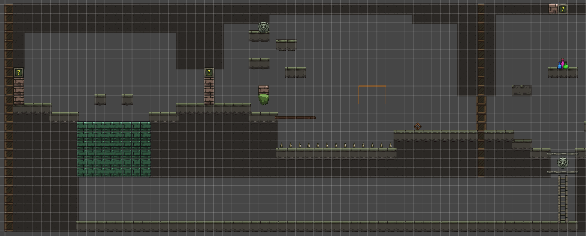

##### 入口区（右侧，0-30格）

- **入口位置**：玩家从第4房间左侧出口进入，落在第五房间右侧的独立石质平台上

##### 摇杆平台区（中央，30-70格）

- **摇杆机关**：位于房间中央偏下的位置，底座为绿色，手柄为棕色木质，呈倾斜待拉动状态
- **操作方式**：玩家靠近后按E键**按住持续操控**——按住E时摇杆保持拉动状态，上方移动平台持续向右侧移动；松开E时摇杆复位，平台会自然向左复位。
- **平台移动参数**：平台从最左移到最右耗时约3-4秒，移动时有低沉的机械齿轮声+轻微画面震动
- **平台位置反馈**：平台上有两个火把，玩家在黑暗中能看到平台具体位置
- **跳跃时机**：玩家需要在平台移动到最右端时松手，然后跳上平台，之后平台向左回移，将玩家送往左侧

##### 左侧石门区（左端，70-100格）

- **第一道石门（石门1）**：位于左侧最前端。玩家到达左侧石门区后，继续向上跳跃到达狮子头按钮平台，按下按钮后门开启
- **第二道石门（石门2）**：紧邻第一道石门右侧。初始状态紧闭，需要第4房间底部的狮子头按钮才能开启
- **石门外观**：棕色石砖结构，顶部有绿色问号标记。两道门并列形成双门结构，视觉上形成"连续关卡"的暗示
- **按钮反馈**：按下第一道石门的狮子头按钮时，按钮双眼亮起红光+机械咔哒声，石门同步播放砖块移开动画+灰尘粒子效果

##### 被困空间区（石门1与石门2之间，100-110格）

这是整个房间最关键的体验节点——玩家按下第一道石门按钮后，进入石门1与石门2之间的狭小空间，然后发现**无处可去**。

- **空间封闭感**：石门1在玩家身后关闭，左侧只有紧闭的石门2，右侧是已关闭的石门1，上方是天花板，下方是水体。玩家环顾四周发现"无处可去"
- **空间尺寸**：被困空间宽约3-4格，四周是光秃秃的石墙，唯一的"有东西"就是脚下的水体
- **水体视觉提示**：水面上偶尔冒出气泡，暗示下方有空间。角色站在水边时水面有微微的波纹反应，鼓励玩家靠近观察
- **没有文字提示**：不给任何"你可以跳进水里"的文字提示。玩家必须自主回忆起第3房间"水体可穿越"的经验
- **尝试的容错**：水体看起来是深渊，但玩家跳下去不会死亡——而是进入水下通道。

##### 水体秘密通道区（底部，110-120格）

- **入水体验**：玩家决定跳入水体后，沿用第3和第4房间的"浸入"动画（角色半透明+气泡粒子），保持机制一致性
- **到达第4房间**：玩家从通道出来时，正好位于第4房间底部狮子头按钮的下方或侧方。出来时有一个短暂的"视野展开"——看到熟悉的第4房间底部场景，产生"原来这里通向那个房间"的认知时刻
- **第4房间按钮按下**：玩家爬梯子上来后，正好站在狮子头按钮的右侧。按下按钮时，整个第4房间有轻微震动，第5房间方向传来远处的机械运转声，暗示"那边有什么东西变了"

##### 返回第5房间与第二道石门开启

- **返回路径**：玩家从第4房间按钮处跳上石平台回到第5房间
- **门后过渡**：第二道门后通往第6房间。

##### 房间核心体验总结

| 阶段                    | 玩家情绪  | 对应内容                      |
| ----------------------- | --------- | ----------------------------- |
| 进入房间，发现摇杆      | 好奇      | "这个摇杆能控制什么？"        |
| 拉动摇杆，平台移动      | 理解      | "原来平台可以移动"            |
| 松开摇杆，跳上平台      | 专注      | 掌握时机跳跃                  |
| 到达左侧，按下按钮      | 成就      | "第一道门开了"                |
| 进入第一道门后被困      | 困惑→焦虑 | "等等，出不去了？"            |
| 观察四周，发现水体      | 思考      | "水……第3房间的水是可以穿过的" |
| 决定跳入水体            | 紧张      | "试试看……"                    |
| 穿过通道到达第4房间     | 惊喜      | "原来这里通向之前的地方！"    |
| 按下第4房间按钮         | 顿悟      | "原来那个按钮是这样按的！"    |
| 返回第5房间，第二道门开 | 如释重负  | "终于过去了"                  |

### （六）第6房间「翡翠秘藏」详细设计

房间尺寸：1920×1080（120×67格）。玩家从第5房间左侧出口进入本房间。整体呈对称碗形结构，分为入口区、两侧阶梯平台区、中央宝箱区。本关是宝箱奖励房间，开启宝箱获取翡翠宝石。房间没有解谜机关，作为第5房间高强度解谜后的节奏缓冲与奖励。

##### 房间结构

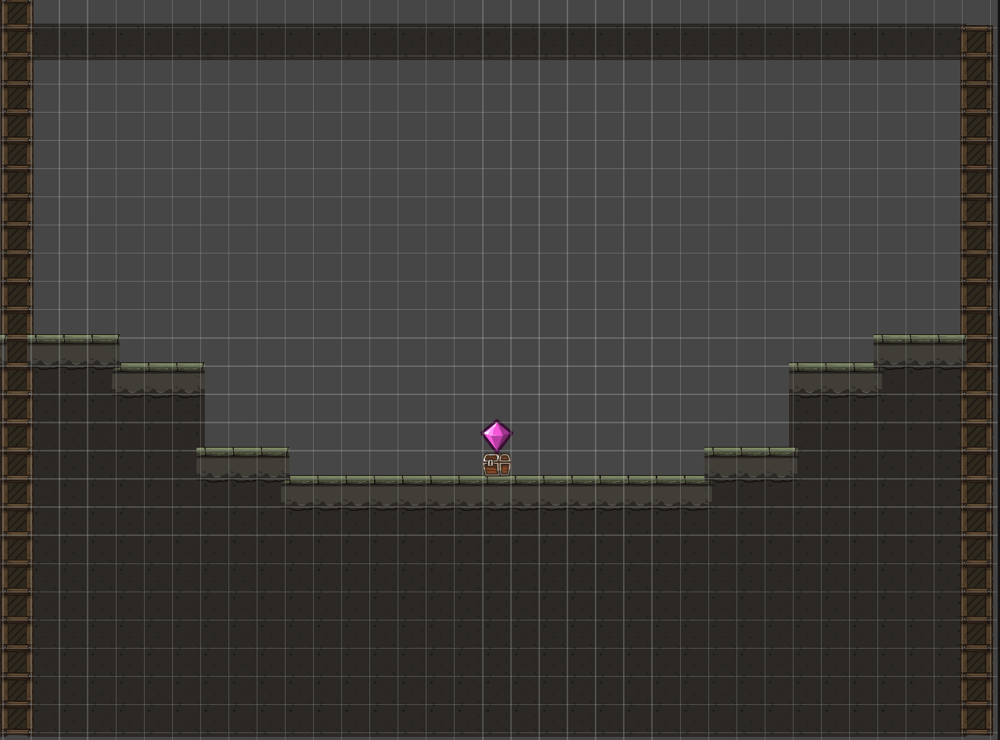

##### 入口区（右上端）

- **入口**：玩家从第5房间左侧出口进入，初始位置位于房间右侧的小平台上
- **视野展开**：玩家站定后，视野向下展开，看到对称的阶梯平台结构向中央收拢，中央平台上方的绿色光芒在黑暗中隐约可见——翡翠宝石的微光成为整个房间的视觉锚点
- **无机关设计**：本房间没有按钮、门、摇杆等解谜机关，强调"看到目标→抵达目标→获取奖励"的纯粹体验

##### 两侧阶梯平台区

- **苔藓边缘**：平台边缘覆盖绿色苔藓，开灯后可见苔藓发出微弱荧光，平台表面刻有古老纹路——暗示这是一处远古文明存放宝藏的密室

##### 中央宝箱区

- **中央平台**：位于房间底部中央，是最大的平台（约8格宽）。平台上放置一只木质宝箱
- **宝石光芒**：翡翠宝石在黑暗中持续散发绿色微光，是整个房间的视觉焦点。随着玩家接近，光芒逐渐增强，营造"它在召唤你"的氛围
- **宝箱开启**：玩家互动（按E键）开启宝箱，宝箱缓缓打开，翡翠宝石的光芒瞬间绽放后飞入玩家背包。获取后提示"翡翠宝石——地表之门的钥匙"
- **翡翠宝石**：关键道具，与琥珀宝石、紫金宝石一同用于开启第12房间通往地表的大门

##### 出口

- **后续路径**：玩家继续向左探索到达第7房间

##### 设计意图

本房间是整个游戏流程中的"喘息与奖励"节点。经过第5房间复杂的摇杆解谜和跨房间联动后，玩家需要一个奖励房间来释放积累的解谜压力。对称阶梯结构与中央宝箱营造出宝藏密室的仪式感，翡翠宝石的绿色光芒在黑暗中形成强烈的视觉牵引——玩家从进入房间的第一秒就知道目标在哪里，剩下的只是"如何到达"。

翡翠宝石是通往地表的关键钥匙之一，将其放在第5房间高强度解谜后的宝箱房中，让玩家获得这份关键奖励，形成中期流程的里程碑时刻。

### （七）第7房间「断崖秘径」详细设计

- 玩家从第6房间左侧进入，落在房间右侧平台区域
- 羽翎靴放置在房间下方的中央平台上，玩家获取后解锁二段跳能力
- 获取羽翎靴后，玩家可利用二段跳跳跃至此前无法到达的中层与高层平台，逐步向上攀升
- 房间上方中央有一架梯子，需通过二段跳攀上高层平台后才能到达
- 梯子通往第10房间。玩家进入第10房间后发现需要召唤哨才能破解谜题，但此时尚未获取召唤哨，只能返回第7房间
- 返回第7房间后，从房间左侧出口前往第8房间

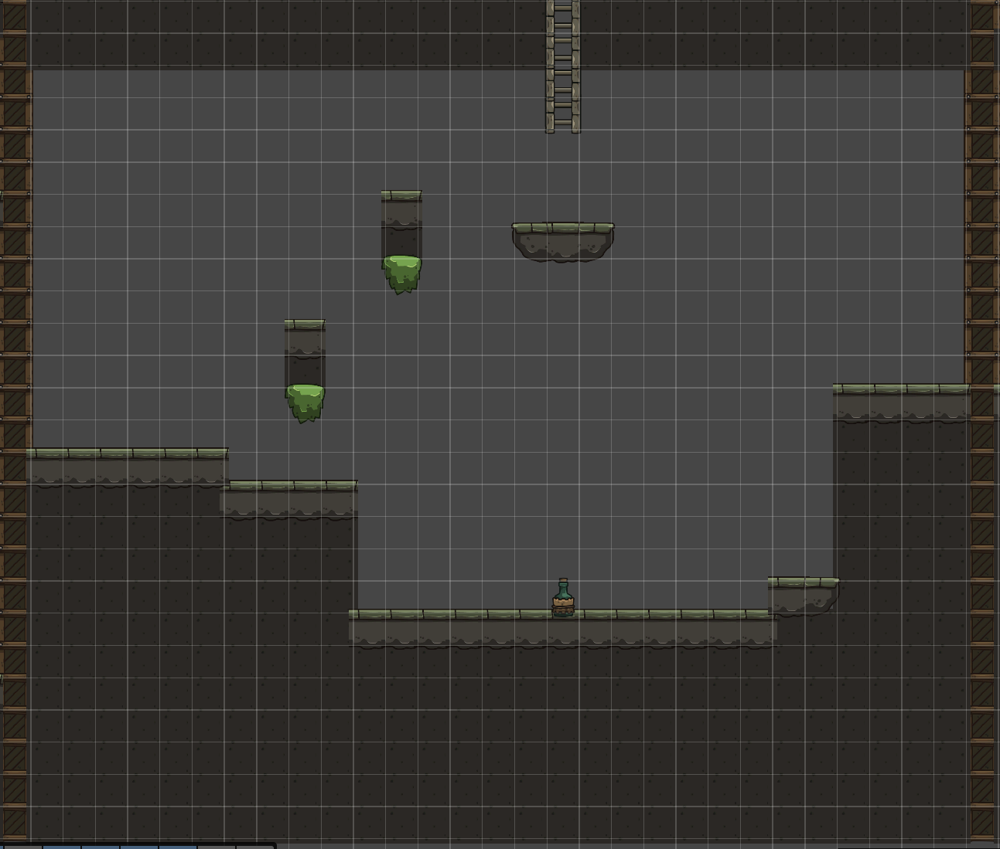

### （八）第8房间「交替危崖」详细设计

- 纵向结构房间，玩家从第7房间左侧出口进入，落在房间下方区域
- 房间底部铺满地刺，玩家坠落即失败，从房间入口重生
- 房间中分布红色与绿色两组平台，两组平台交替出现：红色平台实体时绿色平台消失，反之亦然，交替周期约1.5秒
- 玩家需要观察平台交替节奏，掌握跳跃时机，逐级向上攀升
- 部分平台间距较大，需结合二段跳跨越
- 房间右上角有一架梯子，玩家到达后攀爬进入第9房间

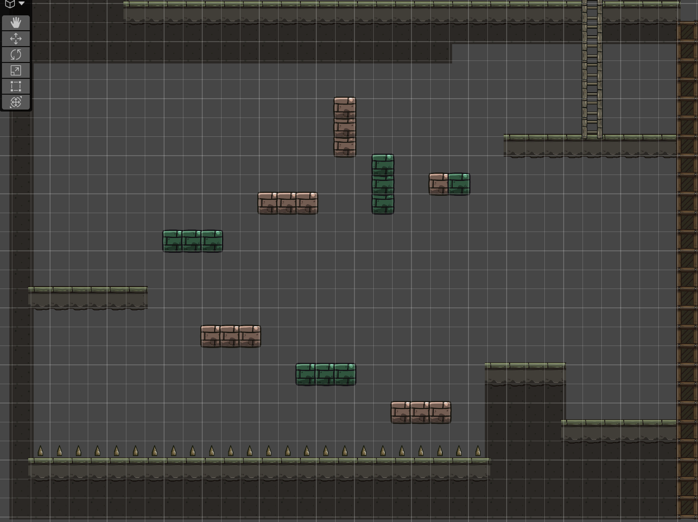

### （九）第9房间「双钮石殿」详细设计

第9房间是召唤哨的获取与教学房间，引入"双体协作+延迟操控"的核心解谜机制。玩家从第8房间右上角的梯子攀爬进入本房间。房间尺寸为1920×1080（120×67格），整体呈纵向结构，分为入口梯子区、底部雕像区、中部平台跳跃区、上方双按钮区和右侧隐藏区。

#### 房间结构总览

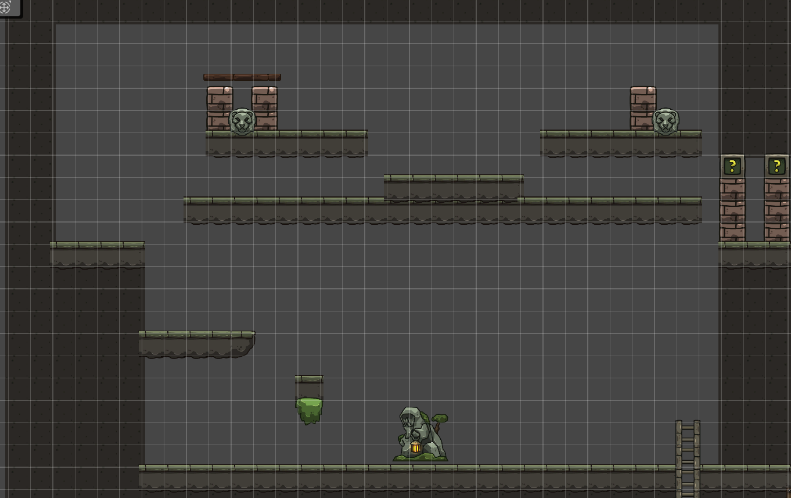

#### 入口梯子区（下方）

- **入口**：玩家从第8房间右上角的梯子攀爬而上，进入第9房间底部地面区域
- **初见场景**：玩家落地后，看到房间中央有一座提着灯的石像，石像手中的灯发出温暖黄光，是整个房间的视觉焦点
- **石像互动**：玩家走近石像按E键互动，石像手中的灯熄灭并碎裂，一只骨质小哨从石像手中浮起——玩家获得召唤哨。获取后提示"召唤哨已获得——按Q召唤并操控小老鼠"

#### 中部平台跳跃区

- **平台布局**：石像上方分布3-4个水平平台，平台间距4-5格，单段跳无法到达，必须使用二段跳逐级向上攀升
- **渐进引导**：第一个平台间距3格（单段跳可达），作为过渡；后续平台间距逐渐增大至5格，逼迫玩家使用二段跳

#### 上方双按钮区

- **左按钮（狮子头）**：位于上方左侧平台，平台较小且周围有矮墙阻挡，玩家身体无法到达。仅小老鼠可以钻入并踩踏按钮
- **右按钮（狮子头）**：位于上方右侧平台，玩家通过二段跳可以到达并踩踏
- **门开启条件**：左右两个按钮必须同时踩下，右侧的问号门才会开启。任一按钮松开，门立即关闭
- **核心矛盾**：玩家一个人无法同时踩两个按钮——右按钮玩家自己踩，左按钮必须操控老鼠去踩

#### 老鼠延迟操控机制

- **延迟设计**：玩家操控老鼠时，老鼠的动作具有0.8秒延迟。即玩家输入移动指令后，老鼠在0.8秒后才执行该动作
- **延迟影响**：
  - 延迟增加了操控难度，但也给予玩家"预判与规划"的解谜乐趣

#### 解谜流程

1. 玩家从底部石像处获得召唤哨
2. 玩家通过二段跳攀上中部平台，到达右按钮位置
3. 玩家踩住右按钮，观察左按钮的位置和老鼠需要行进的路径
4. 玩家按Q召唤老鼠，切换至老鼠操控模式
5. 玩家操控老鼠向左按钮方向移动
6. 操控老鼠踩下左按钮
7. 两个按钮同时被踩下，右侧问号门开启

#### 返回路径与右侧出口

- **右侧出口**：房间右侧有一扇石门，通往第11房间「滞转古殿」。玩家可在获取召唤哨后从此出口进入第11房间探索
- **回头探索动机**：玩家获得召唤哨后，会想起此前从第7房间梯子进入第10房间时无法解谜的机关——现在有了召唤哨，可以返回第10房间破解谜题
- **返回路线**：第9房间→（梯子）→第8房间→（右侧出口）→第7房间→（梯子）→第10房间

#### 设计意图

本房间引入召唤哨与双体协作机制。延迟操控是核心设计：0.8秒的延迟让"操控老鼠"不再是简单的即时控制，而是需要预判和规划的解谜行为。玩家必须提前计算老鼠的行进路线和到达时间，这为后续第10房间（需召唤哨解谜获取琥珀宝石）和第12房间Boss战（老鼠诱敌）奠定了操作基础。

左按钮"仅老鼠可踩"的设计建立了"玩家与老鼠各有能力边界"的认知，让玩家理解为什么需要双体协作而非单角色解决所有问题。

本房间不与第10房间直接连通，玩家获得召唤哨后需原路返回第8房间→第7房间→经第7房间梯子前往第10房间，形成"获取能力→回头解谜"的类银探索闭环。

### （十）第10房间「琥珀圣龛」详细设计

第10房间是琥珀宝石的获取房间，玩家需运用召唤哨操控老鼠完成双按钮解谜。房间仅可通过第7房间顶部梯子进入，不与第9房间连通。房间尺寸为1920×1080（120×67格），整体呈双层横向结构，分为下层平台区和上层宝箱区。

#### 房间结构总览

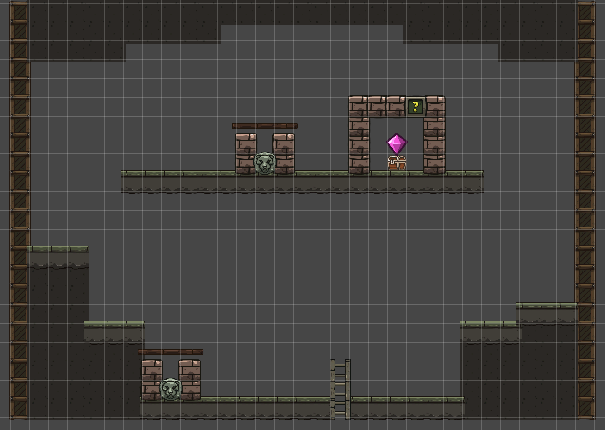

#### 首次进入（无召唤哨）

- **入口**：玩家从第7房间顶部梯子攀爬进入，落在下层平台区
- **视野展开**：玩家看到上层平台有一只宝箱，宝箱上方悬浮琥珀色光芒，宝箱被一道机关锁封住
- **无法解谜**：上层平台有两个狮子头按钮（左、右），但按钮位于玩家无法到达的位置——按钮所在的平台周围有矮墙，仅老鼠能钻入。玩家此时尚未获得召唤哨，无法召唤老鼠
- **刻痕暗示**：宝箱旁的墙壁上有模糊刻痕，开灯后显现出老鼠钻入管道的图案——暗示需要召唤哨
- **返回**：玩家无法解谜，原路返回第7房间继续探索

#### 获取召唤哨后返回解谜

- **回头动机**：玩家在第9房间获取召唤哨后，想起第10房间的机关需要老鼠，返回第7房间经梯子再次进入第10房间
- **解谜流程**：
  1. 玩家在下层平台召唤老鼠
  2. 老鼠先按下下层平台区的第一个按钮
  3. 再操控老鼠通过二段跳到达上层平台区按下第二个按钮
  4. 两个按钮同时生效，宝箱上方的机关锁解锁
- **机关锁解锁**：机关锁发出琥珀色光芒后碎裂消散，宝箱可互动开启

#### 宝箱奖励

- **琥珀宝石**：从宝箱中获取，散发温暖琥珀色光芒。获取后提示"琥珀宝石——深层之门的钥匙"
- **用途**：与翡翠宝石、紫金宝石一同用于开启第12房间通往地表的大门

#### 出口

- 此房间为琥珀宝石收集房间，故玩家收集完之后需要返回第9房间，再由第9房间的右侧出口去往第11房间

#### 设计意图

本房间是"获取能力→回头解谜"类银探索逻辑的核心体现。玩家首次进入时无法解谜，获得召唤哨后返回——这一回头过程让玩家深刻感受到"世界是互联互通的，能力解锁新路径"的探索乐趣。

### （十一）第11房间「滞转古殿」详细设计

第11房间是紫金宝石的获取房间，核心机制为"机关滞后"——房间内的机关响应存在显著延迟，玩家需要预判机关运作时机。玩家从第9房间右侧出口进入本房间。房间尺寸为1920×1080（120×67格），整体呈横向结构，分为石平台区、机关滞后区、石桥水域区、双按钮石门区和隐藏通道区。

#### 房间结构总览

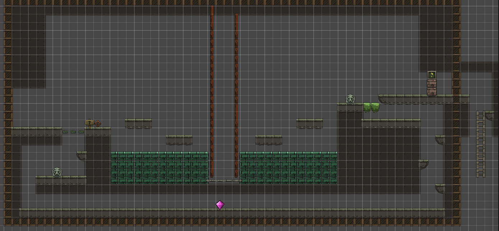

#### 石平台区（左侧入口）

- **入口**：玩家从第9房间右侧出口进入，落在房间左侧的石平台上
- **石平台阻挡**：玩家和小老鼠都无法从石平台上直接落下到下方区域，只能向右走
- **设计意图**：强制玩家沿横向路径探索，而非直接跳下走捷径

#### 机关滞后区（中部）

- **提示牌**：玩家向右走，遇到一块木牌，上面写着"此处的机关似乎老化了，运作很滞后"——向玩家传达本房间的核心机制：机关按下后有延迟才会生效
- **按钮1（升石桥按钮）**：牌子右侧有一个狮子头按钮，互动后水中会升起一座石桥，但并非立即升起——需要等待数秒后石桥才缓缓从水中升起
- **跳跃平台**：按下按钮1后，玩家需跳跃两个平台到达右侧区域。两个平台间距适中，普通跳跃即可到达
- **等待石桥**：玩家到达右侧区域后，需要等待滞后的机关运作，石桥从水中缓慢升起。这段时间形成自然的节奏停顿，让玩家观察周围环境

#### 石桥水域区

- **石桥升起**：石桥从水中升起后，连接跳跃平台与右侧高台。石桥表面湿滑，有水渍粒子效果
- **通过石桥**：玩家走过石桥到达右侧平台
- **水域**：石桥下方是水域，玩家若失足落入水中会返回左侧入口区域

#### 双按钮石门区（右侧）

- **按钮2（开门按钮）**：玩家到达右侧平台后，发现一个狮子头按钮。按下后，右侧石门发出机械声但未开启——石门旁的刻痕显示需要两个按钮同时按下才能开启
- **核心矛盾**：按钮1（升石桥）在左侧，按钮2（开门）在右侧，玩家无法同时按下两个按钮。石门需要两个按钮同时处于按下状态才开启
- **草丛发现**：玩家在右侧平台观察时，如果开启照明灯照射草丛，会发现灯光能透过草丛——草丛后方有一条隐藏通道的入口。关灯时草丛完全不透光，看起来只是装饰

#### 隐藏通道区

- **通道入口**：草丛后方的隐藏通道，仅开灯照射草丛时才能发现入口位置
- **紫金宝石**：进入通道后，在通道深处发现紫金宝石，散发紫金双色光芒。获取后提示"紫金宝石——归途之门的钥匙"
- **通道路径**：通道向左下方延伸，穿过石平台下方的区域，到达石平台正下方的位置——这里就是按钮1所在的延长线上，但位于石平台下方，是玩家从石平台上无法到达的位置
- **第二个按钮**：通道尽头有一个狮子头按钮（即石门所需的第二个按钮）。按下此按钮后，它与右侧的按钮2共同满足"两个按钮同时按下"的条件，石门开启

#### 解谜流程总结

1. 玩家从第9房间右侧进入，落在石平台上，无法落下，只能向右走
2. 看到提示牌"机关老化，运作滞后"
3. 按下按钮1（升石桥按钮），水中石桥延迟数秒后升起
4. 跳跃两个平台到达右侧
5. 等待石桥升起，走过石桥到达右侧平台
6. 按下按钮2（开门按钮），发现石门需要两个按钮同时按下
7. 开灯照射草丛，发现光能透过草丛，看到隐藏通道入口
8. 进入通道，获取紫金宝石
9. 通过通道到达石平台下方的第二个按钮，按下按钮
10. 两个按钮同时按下，石门开启，进入一段向下的狭长通道

#### 设计意图

本房间将"机关滞后"作为核心机制——与第9房间的老鼠延迟操控形成呼应，但这里延迟转移到环境机关上。玩家需要理解"按下后不会立即生效"的规律，并在等待期间观察环境、发现线索。

"光能透过草丛"是本房间的关键发现点：玩家必须主动使用照明灯照射草丛才能发现隐藏通道。

紫金宝石是第三颗也是最后一颗宝石。至此玩家集齐翡翠宝石、琥珀宝石、紫金宝石三颗宝石。

#### 房间出口与狭长通道

石门开启后，玩家并非直接进入Boss房，而是进入一段向下的狭长通道。通道狭窄（仅2格宽），玩家需攀爬梯子向下延伸约15-20格。通道两侧石壁上偶有微弱荧光苔藓点缀，向下逐渐变得潮湿。

通道底端连接第3房间「荧光甬道」的左上角梯子——玩家从高处向下回归到游戏早期探索过的房间。这一设计形成“从深处回归”的探索闭环：玩家带着三颗宝石和全部道具，回到最初经过钥匙门的第3房间，用钥匙打开右上角门，正式进入第12房间Boss战。

### （十二）第12房间「潜行暗渊」详细设计

第12房间是整个游戏的高潮关卡，综合考验玩家对三大道具与光暗机制的掌握。玩家从第3房间右上角钥匙门进入本房间。房间尺寸为5760×1080（360×67格），分为三层纵向结构：第一层（暗影潜行层）、第二层（追赶操作层）、第三层（宝石逃离层）。玩家需持有翡翠宝石、琥珀宝石与紫金宝石三颗宝石方可开启通往地表的逃离大门。

#### 房间结构总览

#### 第一层：暗影潜行层（0-120格）

- **环境**：完全黑暗，无任何环境光源。
- **Boss状态**：Boss在第一层中间沿水平方向缓慢巡逻，触须低垂
- **玩家目标**：从入口关灯潜行至第一层末端，进入第二层
- **核心操作**：
  - 照明灯必须保持关闭。开灯会立即引起Boss警戒并进入追击
  - 正常行走（A/D）脚步声在Boss听觉范围外，安全
- **层间过渡**：第一层末端有一道光敏屏障门，玩家需开灯照射水晶开关2秒开启。屏障门开启后玩家进入第二层，屏障门在玩家通过后关闭——这道屏障将Boss暂时隔绝在第一层
- **检查点**：通过屏障门进入第二层时自动存档。玩家在第二层或第三层被Boss捕获后，从此处重生，无需重新潜行第一层

#### 第二层：追赶操作层（120-240格）

玩家进入第二层的瞬间，Boss在第一层入口处感知到光源（玩家开灯开门的余光），开始沿玩家走过的路径追赶。Boss从第一层入口出发，经过第一层全程，遇到屏障门会被阻挡一段时间，之后进入第二层追赶玩家。

第二层分为追赶段和操作段：

##### 追赶段（120-180格）

- **Boss追赶机制**：
  - Boss比玩家正常行走快。玩家必须持续移动，不能原地停留
  - Boss在追赶时不会二段跳，遇到高处平台需要绕路——玩家利用二段跳到达Boss无法直接跟进的高台，可以争取喘息时间
  - Boss沿玩家走过的路径追赶，不会抄近路。玩家可以通过复杂路线拉开距离
- **玩家目标**：穿越追赶段到达操作段的高台安全区
- **核心操作**：平台跳跃+利用二段跳到达高处

##### 操作段（180-240格）

- **环境**：操作段入口处有一道强光屏障（与第一层屏障门类似），Boss会被阻挡一段时间。玩家进入操作段后暂时安全，但强光屏障会缓慢减弱
- **三项操作**（需在屏障消失前完成）：
  1. **照宝石开门**：用照明灯照射墙壁上的三颗宝石形凹槽（每颗需持续照射2秒），激活通往第三层的通道机关。三颗凹槽需按特定顺序照射——墙壁刻痕暗示顺序（翡翠→琥珀→紫金）
  2. **操控老鼠按按钮**：操作段右侧有一个狮子头按钮，位于一道仅老鼠能钻入的窄缝管道内。玩家需吹哨召唤老鼠，操控老鼠通过管道按下按钮，激活通往第三层的梯子
  3. **二段跳高处按钮**：操作段左上方有一个高台按钮，距地面约5格，需二段跳才能到达。按下后解锁第三层入口大门
- **时间压力**：三项操作必须在光敏屏障消失前完成。屏障每15秒减弱一档（共4档），视觉上屏障光芒逐渐变暗，音效上Boss的低吼声越来越近
- **完成条件**：三项操作全部完成后，通往第三层的通道开启，玩家攀爬梯子进入第三层

#### 第三层：宝石逃离层（240-360格）

- **环境**：通道两侧墙壁布满荧光蘑菇，持续发光。通道宽阔（5格宽），无掩体。末端是三宝石之门
- **Boss状态**：Boss穿过消失的屏障进入第三层，继续追赶玩家。Boss在第三层的移动速度与追赶段一致
- **环境叙事（替代文字指示牌）**：
  - **古老壁画**：三宝石之门旁的墙壁上有一幅壁画——画中一只小生物引开了一只巨兽，巨兽身后的人正在将三颗宝石依次嵌入石门。壁画暗示了"老鼠引开Boss"的策略和宝石嵌入的顺序
  - **探险者遗骸**：壁画旁有一具探险者遗骸，手中握着一只骨质小哨（与召唤哨外观一致）——暗示此前有人想到了这个策略但未能完成。遗骸旁散落着两颗未嵌入的宝石残片
- **三宝石之门嵌入机制**：
  - 三颗宝石需**依次嵌入**三个凹槽（翡翠→琥珀→紫金），每颗嵌入需持续按住E键2-3秒
  - 嵌入宝石时玩家无法移动——这就是为什么需要用老鼠引开Boss争取时间
  - 错误顺序会弹出已嵌入的宝石，需重新开始
- **解法流程**：
  1. 玩家进入第三层后，首先观察壁画和遗骸，理解"用老鼠引开Boss"的策略
  2. 吹哨召唤老鼠，操控老鼠向远离三宝石之门的方向移动，进入Boss感知范围（6格内）
  3. Boss进入分心状态，转向追击老鼠——这为玩家争取约15-20秒的操作窗口
  4. 迅速切回玩家操控，按正确顺序依次嵌入三颗宝石（约需15秒）
  5. 第三颗宝石嵌入后，三宝石之门缓缓开启，阳光从门缝中涌入
- **最终冲刺**：
  - 大门开启需要3秒动画，此时Boss已经捕获老鼠并转向玩家冲来
  - 玩家必须在Boss扑到之前冲过大门
  - 玩家冲过大门后大门立即关闭，将Boss隔绝在身后
  - 这个"最后几步冲刺"成为整个游戏最紧张的高潮收尾
- **容错窗口**：老鼠引开Boss的时间（约15-20秒）与嵌入三颗宝石的时间（约15秒）之间有约3-5秒的容错。如果玩家操作不够快，Boss会在嵌入最后一颗宝石前赶到——此时玩家需要放弃嵌入，重新召唤老鼠引开Boss，从头开始嵌入

#### 完整通关流程时间线

| 时间      | 阶段       | 玩家操作                           | Boss状态                       |
| --------- | ---------- | ---------------------------------- | ------------------------------ |
| 0:00-0:30 | 第一层入口 | 关灯，缓慢行走潜入                 | 远端巡逻                       |
| 0:30-1:00 | 第一层中段 | 下蹲通过低矮通道                   | 巡逻中，偶尔转向               |
| 1:00-1:10 | 第一层末端 | 开灯照射水晶开关，屏障门开启       | 巡逻中                         |
| 1:10-1:15 | 进入第二层 | 通过屏障门，检查点存档             | 感知到光源，开始沿玩家路径追赶 |
| 1:15-1:40 | 追赶段     | 平台跳跃，二段跳上高台拉开距离     | 从第一层入口出发，沿路径追赶   |
| 1:40-1:45 | 进入操作段 | 越过光敏屏障进入安全区             | 接近追赶段，被屏障暂时阻挡     |
| 1:45-2:00 | 操作1      | 照射三颗宝石凹槽（按顺序）         | 屏障后徘徊，屏障缓慢减弱       |
| 2:00-2:15 | 操作2      | 召唤老鼠，操控老鼠通过管道按按钮   | 屏障继续减弱                   |
| 2:15-2:30 | 操作3      | 二段跳上高台按下按钮               | 屏障接近消失                   |
| 2:30-2:35 | 进入第三层 | 攀爬梯子进入第三层                 | 屏障消失，Boss进入第二层       |
| 2:35-2:40 | 观察壁画   | 观察壁画和遗骸，理解老鼠诱敌策略   | 穿过第二层，进入第三层追赶     |
| 2:40-2:45 | 召唤老鼠   | 吹哨召唤老鼠，操控老鼠远离大门方向 | 发现老鼠→分心，转向追击老鼠    |
| 2:45-3:00 | 嵌入宝石   | 依次嵌入翡翠→琥珀→紫金三颗宝石     | 追击老鼠中                     |
| 3:00-3:03 | 大门开启   | 等待大门开启动画                   | 捕获老鼠，转向玩家冲来         |
| 3:03-3:06 | 最终冲刺   | 冲过三宝石之门                     | 扑向玩家，大门关闭将其隔绝     |
| 3:06-3:20 | 结局演出   | 走向地表，光线渐变，结局画面       | 被隔绝在门后，低吼渐远         |

> 以上时间为理想通关时间参考。实际游玩中玩家可能多次失败重来，熟练后可压缩至3分钟以内。失败后从第二层入口检查点重生，Boss重置到第一层入口重新开始追赶。

#### 设计意图

本房间采用三层纵向结构，将Boss战拆解为三种不同的压力模式：

- **第一层（潜行压力）**：玩家在黑暗中小心前行，任何声响和光源都可能引来Boss。这是对全程光暗潜行机制的总检验
- **第二层（追赶压力+解谜压力）**：Boss沿玩家路径追赶的机制把整个第二层变成"倒计时"——玩家既要跑酷拉开距离，又要在光敏屏障保护下完成三项操作。追赶段与操作段的分离确保玩家不会在解谜时被Boss直接杀死，但屏障减弱的时间压力让"安全"是相对的
- **第三层（抉择压力）**：玩家必须在有限时间内做出"嵌入宝石还是重新引开Boss"的抉择。壁画和遗骸的环境叙事让玩家自主发现解法，而非文字提示。最终冲刺将整个游戏的紧张感推向最高潮

Boss"走玩家走过的路"的设计让整个房间具有空间叙事感——玩家走过的每一步都成为Boss追赶的路径，玩家在跑酷时留下的路线选择直接影响Boss的追赶速度。

---

## 四、开发路线

### （一）阶段一：核心原型

#### 1. 玩家3C + 道具基础

- [ ] 角色控制器：A/D移动（带惯性）、空格跳跃
- [ ] 照明灯系统：F键开关、锥形光照渲染、鼠标方向跟随
- [ ] 二段跳系统：空中二段跳判定与动画
- [ ] 召唤哨系统：Q键召唤老鼠、R操控模式切换、摄像机切换
- [ ] 老鼠控制器：独立移动/跳跃/二段跳、体型差异碰撞

#### 2. 光照系统

- [ ] 2D光照渲染：锥形光源（玩家灯光）、圆形光源（环境光）
- [ ] 光照碰撞检测：光线遮挡（石柱挡光）、光照范围判定
- [ ] 光敏机关：水晶开关（持续照射2秒激活）

#### 3. Boss AI

- [ ] 状态机框架：巡逻/警戒/追击/搜索/分心五状态
- [ ] 光源感知：检测感知范围内是否存在光源
- [ ] 老鼠感知：检测老鼠是否进入分心感知范围
- [ ] 优先级判定：老鼠优先于玩家
- [ ] 追击路径：简化直线追击+绕障基础

---

### （二）阶段二：前置房间与道具获取

> 目标：实现第1-11房间，完成三道具的获取流程与教学引导。

#### 1. 房间1-3（照明灯教学+解谜入门）

- [ ] 第1房间：阶梯平台跳跃+狮子头按钮+砖墙密室获取照明灯+光敏水晶出口机关
- [ ] 第2房间：水滴颜色顺序记忆解谜+三个互动装置+天花板水滴下落+水面颜色观察平台+三个颜色按钮+石门开启
- [ ] 第3房间：入口区右上钥匙门"现在/以后"并置（钥匙门通往第12Boss房）+右下按钮微光提示+双按钮顺序解谜+休眠光敏生物（被照光后警告声，不攻击）+水体穿越视觉表现+下方问号门因果反馈+通往第4房间过渡+左上方梯子通往狭长通道（需二段跳，首次无法到达）

#### 2. 房间4（致幻延迟视觉）

- [ ] 致幻蘑菇系统：食用后进入1秒延迟视觉状态（画面缓冲区渲染1秒前的帧）
- [ ] 延迟视觉渲染：画面延迟管线、灯光方向延迟、色彩扭曲过渡动画
- [ ] 教学缓冲区：虚空平台
- [ ] 交替平台系统：3个平台每1.5秒交替
- [ ] 地刺陷阱：玩家碰到地刺重生
- [ ] 失败重生逻辑：保留致幻状态重生+左下角重生点
- [ ] 宝箱双重奖励：钥匙（解锁第3房间右上角门，通往Boss房）+解除幻觉发光果实
- [ ] 恢复正常视觉的对比效果：瞬间清晰+柔光环绕
- [ ] 底部狮子头按钮预留：石平台阻挡反馈+裂缝暗示+未来通道入口

#### 3. 房间5（摇杆解谜+跨房间联动）

- [ ] 第5房间：摇杆按住操控平台系统+石门按钮+被困空间设计+水体气泡暗示+水下秘密通道+跨房间到达第4房间按钮+返回解锁第二道石门
- [ ] 摇杆手感调优：按住/松开的响应延迟、平台移动速度曲线、最右端停留时间

#### 4. 房间6（宝箱奖励）

- [ ] 第6房间：对称阶梯平台结构+中央宝箱+翡翠宝石获取
- [ ] 宝箱开启动画：翡翠宝石光芒绽放演出

#### 5. 房间7-8（二段跳+平台跳跃）

- [ ] 第7房间：羽翎靴拾取+二段跳渐进教学+中层至高层平台跳跃+顶部梯子通往第10房间+左侧出口通往第8房间
- [ ] 第8房间：红绿交替平台系统+地刺陷阱+时机跳跃挑战+右上梯子通往第9房间
- [ ] 二段跳手感调优（高度、窗口、空中水平速度重置）

#### 6. 房间9-11（召唤哨教学+回头解谜+机关滞后）

- [ ] 第9房间：提灯石像互动获取召唤哨+二段跳平台攀升+左按钮（仅老鼠可踩）+右按钮（玩家踩）+双按钮同时按下开门+老鼠0.8s延迟操控机制+右侧出口通往第11房间
- [ ] 第10房间：首次进入（无召唤哨）无法解谜+返回第7房间梯子入口+获取召唤哨后返回解谜+双按钮（仅老鼠可踩）+琥珀宝石获取+出口通往第11房间
- [ ] 第11房间：石平台阻挡+提示牌"机关老化"+按钮1升石桥（延迟生效）+跳跃平台+石桥水域+按钮2开门（需双钮）+草丛光透发现隐藏通道+紫金宝石获取+通道内第二按钮+石门开启+狭长通道向下通往第3房间
- [ ] 召唤哨手感调优（召唤/收回、操控模式切换、摄像机过渡）
- [ ] 老鼠延迟操控手感调优（延迟时间、预判反馈、操作响应曲线）
- [ ] 机关滞后手感调优（延迟时长、视觉反馈、玩家等待体验）

> **前置房间验收标准**：新玩家在无任何外部引导的情况下，能通过环境设计自主理解三道具的使用方法与解谜机制规则。

---

### （三）阶段三：完整第12房间

#### 1. 第一层暗影潜行

- [ ] 完全黑暗场景渲染（仅玩家2格微光）
- [ ] Boss巡逻路线配置（第一层中间水平巡逻）
- [ ] 层间过渡光敏屏障门（照射水晶开关2秒开启）

#### 2. 第二层追赶操作层

- [ ] Boss追赶AI：沿玩家走过的路径追赶，不会二段跳需绕路
- [ ] 追赶段场景：间隔平台+二段跳高台
- [ ] 光敏屏障系统：阻挡Boss，60秒内4档缓慢减弱
- [ ] 操作1：宝石凹槽照射（按顺序持续照射2秒×3）
- [ ] 操作2：老鼠管道按钮（召唤老鼠+操控通过窄缝管道按下按钮）
- [ ] 操作3：二段跳高处按钮（5格高台）
- [ ] 三项操作全部完成→通往第三层通道开启

#### 3. 第三层宝石逃离层

- [ ] 荧光蘑菇持续发光场景渲染
- [ ] 环境叙事：古老壁画（老鼠引开巨兽+宝石嵌入顺序）+探险者遗骸（手持骨质小哨）
- [ ] 三宝石之门嵌入机制（依次嵌入E键2-3秒，错误顺序弹出重置）
- [ ] 老鼠诱敌策略验证（老鼠引开Boss约15-20秒操作窗口）
- [ ] 最终冲刺：大门开启3秒动画+Boss冲来+玩家冲过大门+大门关闭隔绝Boss

#### 4. Boss行为完善

- [ ] Boss追赶路径记录与回放（沿玩家走过的路追赶）
- [ ] Boss不会二段跳，高处平台需绕路
- [ ] 光敏屏障阻挡逻辑（屏障消失后Boss继续追赶）
- [ ] 老鼠分心优先级判定（老鼠进入感知范围→转向追击老鼠）

#### 5. 房间过渡与检查点

- [ ] 第10房间→第11房间入口过渡
- [ ] 第11房间→狭长通道→第3房间过渡
- [ ] 第3房间钥匙门→第12房间入口过渡
- [ ] 第12房间→结局演出出口过渡
- [ ] 房间内检查点（第一层→第二层屏障门处自动存档，失败后从此处重生，Boss重置到第一层入口）

> **第12房间验收标准**：玩家能完成第一层潜行→第二层追赶+三项操作→第三层老鼠诱敌+宝石嵌入+最终冲刺→结局演出的完整流程，失败重试体验流畅（从第二层检查点重生），Boss追赶行为在所有场景中表现一致。

---

### （四）阶段四：地图联通与存档

> 目标：将12个房间联通为完整的类银地图，实现存档与回头探索。

#### 1. 地图联通

- [ ] 房间间通道连接与过渡动画
- [ ] 能力门配置（高墙/窄缝/微型管道/光敏大门/光敏屏障）
- [ ] 地图整体平衡性检查（无卡死路径、无不可达区域）

#### 2. 存档系统

- [ ] 检查点存档：每房间入口处自动存档
- [ ] 存档数据：玩家位置、已获取道具、已开启机关、Boss状态
- [ ] 死亡复活：返回最近检查点，机关状态保留

#### 3. 收集品与隐藏内容

- [ ] 隐藏房间：需特定道具组合才能到达的秘密区域
- [ ] 壁画叙事：光照后显现的壁画碎片，拼凑地底世界背景故事

> **地图验收标准**：玩家能自由在12个房间间往返探索，所有能力门正确生效，存档/复活逻辑无异常，隐藏内容有发现惊喜感。

---

### （五）阶段五：视听打磨

> 目标：将功能原型提升为有氛围感的完整游戏体验。

#### 1. 视觉

- [ ] 像素美术：角色/老鼠/Boss/环境全套像素图绘制
- [ ] 光照特效：灯光锥形渐变、环境光柔和过渡、苔藓发光粒子
- [ ] 暗色调氛围：各房间独立调色方案（浅层蓝灰/中层绿紫/深层暗红）
- [ ] 动画：角色行走/跳跃/举灯、老鼠奔跑/跳跃、Boss巡逻/追击/搜索动画
- [ ] 粒子效果：灯光点火粒子、荧光蘑菇孢子

#### 2. 音效

- [ ] 环境音：各房间独立环境音（浅层水滴回声/中层低频嗡鸣/深层地底轰隆）
- [ ] 动作音效：脚步声、跳跃/落地、灯光开关点火声、哨声
- [ ] Boss音效：巡逻低沉呼吸、警戒触须摩擦、追击嘶吼、搜索焦躁喘息
- [ ] 机关音效：水晶开关激活叮鸣、大门开启石磨声
- [ ] 动态音乐：第12房间Boss战紧张音乐随阶段动态变化（第一层潜行低沉→第二层追赶急促→操作段压迫感→第三层最终冲刺高潮）

#### 3. UX与引导

- [ ] 无文字设计：所有引导通过环境视觉语言完成
- [ ] 首次道具获取动画：拾取照明灯/羽翎靴/召唤哨时有简短展示动画
- [ ] 死亡反馈：Boss扑杀时的画面变暗+音效，无"Game Over"文字
- [ ] 通关演出：第12房间走向地表时的光线渐变与结局画面

> **视听验收标准**：游戏在无任何文字提示的情况下，玩家能通过画面与声音完全理解当前状态、危险来源与下一步行动方向。

---

### （六）阶段六：测试与调优

> 目标：消除所有机制漏洞、操作死角与节奏问题，确保通关体验流畅。

#### 1. 机制测试

- [ ] 光照判定边界测试：锥形边缘、遮挡缝隙、多光源叠加
- [ ] Boss AI压力测试：所有状态切换路径覆盖、优先级冲突场景
- [ ] 老鼠操控边界测试：死亡冷却、操控切换时机
- [ ] 平台碰撞测试：光影/暗影平台切换瞬间的站立判定

#### 2. 关卡节奏调优

- [ ] 第12房间时间轴调优：Boss追赶速度与玩家冲刺速度平衡、光敏屏障60秒衰减节奏、三项操作完成时间校准、老鼠引开Boss时长（15-20秒）与宝石嵌入时长（15秒）的容错窗口（3-5秒）
- [ ] 各房间难度曲线验证：确保逐步递进无断崖式提升
- [ ] 失败重试体验：确认每次失败后重置点合理，重试耗时不超过10秒

#### 3. 盲测

- [ ] 邀请3-5名未接触过设计的玩家进行盲测
- [ ] 记录卡点位置、失败原因、通关时长
- [ ] 根据盲测数据调整机关提示强度与Boss感知参数

#### 4. 边界与异常

- [ ] 道具切换异常：快速切换灯光/老鼠操控时的状态一致性
- [ ] 房间过渡异常：过渡瞬间触发机关/移动的边界处理
- [ ] 存档一致性：所有机关状态在存档/读档后正确恢复

> **测试验收标准**：盲测玩家平均在60-90分钟内完成全流程通关，无卡死bug，无机制误解导致的永久卡关，失败重试体验无挫败感累积。
